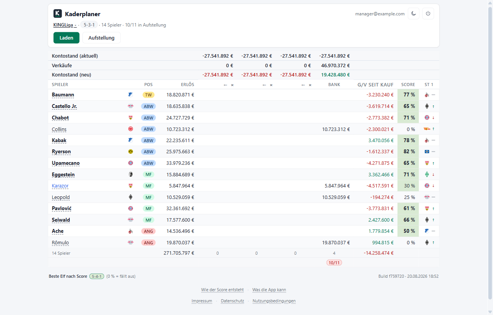
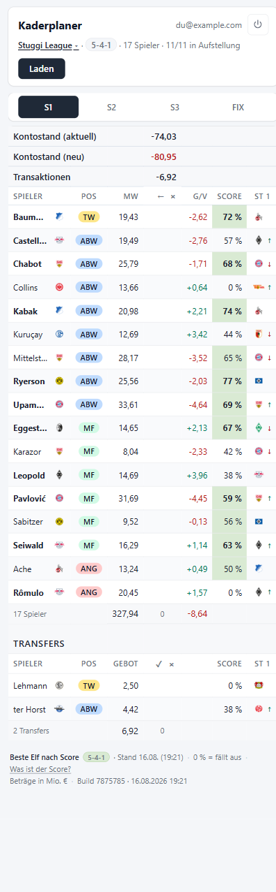
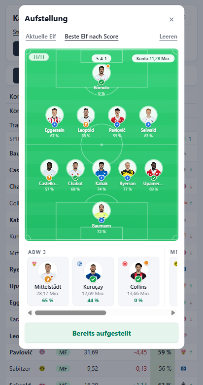

# Kickbase Kaderplaner

Eine Entscheidungshilfe für [Kickbase](https://www.kickbase.com/), die im
Browser läuft. Sie zeigt deinen Kader mit einem Score je Spieler, dem nächsten
Gegner und deinen offenen Geboten, und lässt dich in vier Spalten durchspielen,
wen du verkaufst und was danach auf dem Konto steht.

Kein Server, keine Datenbank. Die App spricht die Kickbase-API direkt aus dem
Browser an und legt nichts ab außer in deinem `localStorage`.



## Was drin ist

- **Score je Spieler**, 0 bis 100 %. Aus Form, Startelf-Prognose und
  Verfügbarkeit. Der Gegner zählt nicht mit, er steht in seiner eigenen Spalte;
  bei der Auswahl der besten Elf entscheidet er nur fast gleiche Fälle. Die
  beste Elf sucht ein Optimizer über alle zehn Formationen.
- **Vier Szenariospalten.** S1 bis S3 hakst du selbst an, BANK hakt von allein
  jeden an, der gerade nicht in deiner Elf steht. Kontostand, Verkäufe und
  Gebote rechnen live mit.
- **Gegner am nächsten Spieltag** als Wappen mit Tendenzpfeil, aus dem
  Spielplan des Wettbewerbs.
- **Transferblock** mit deinen offenen Geboten, auch denen aus der
  Kickbase-App.
- **Aufstellung** auf einem Spielfeld. Der Formations-Chip im Kopf, etwa
  `5-4-1`, öffnet sie. Von dort geht die Elf auch zurück an Kickbase.
- **Eine Tabelle für jede Breite.** Von 320 px bis Desktop entscheidet CSS über
  Container-Queries, welche Spalten passen.

Alles außer der Aufstellung ist nur lesend.

<table>
  <tr valign="top">
    <td></td>
    <td></td>
  </tr>
</table>

Links die Tabelle auf einem 412 px breiten Handy, rechts die Aufstellung hinter
dem Formations-Chip.

## Lokal starten

```sh
npm install
npm run dev          # http://localhost:5173
```

## Bauen und testen

```sh
npm run build        # tsc --noEmit + vite build → dist/
npm run preview      # den fertigen Build lokal ausliefern
npm test             # Vitest, einmalig
npm run test:watch
```

Getestet ist die Rechenlogik: Optimizer, Score-Lauf, Planungstabelle,
Gegner-Spalte, Aufstellung und der API-Client. Die Oberfläche wird von Hand
geprüft.

## Aufbau

```
├─ index.html
├─ public/favicon.svg
├─ src/
│  ├─ main.ts                Einstieg, haengt die App an #app
│  ├─ api/                   Kickbase-Client und Typen
│  ├─ compute/
│  │  ├─ optimizer.ts        Score je Spieler, beste Elf je Formation
│  │  ├─ score.ts            Score-Lauf, Cache, Gegner-Spalte
│  │  ├─ planning.ts         Szenariospalten, Summen, Formationspruefung
│  │  └─ lineup.ts           Aufstellung auf dem Feld
│  ├─ state/                 Sitzung, Szenarien, Optimizer-Cache
│  ├─ storage/local.ts       getippter localStorage-Wrapper
│  ├─ ui/                    Seiten und reine Renderer
│  └─ styles/
└─ tests/
```

## Anmeldung und Daten

Die Anmeldung geht direkt an `https://api.kickbase.com/v4/user/login`. Das
Passwort wird nicht gespeichert, nur das zurückgegebene Token, und das liegt in
deinem Browser. Es gilt sieben Tage.

Im `localStorage` liegen:

| Schlüssel | Inhalt |
| --- | --- |
| `kb.session` | Token, E-Mail, Ligaliste |
| `kb.lastLeagueId` | zuletzt geöffnete Liga |
| `kb.scenarios.<leagueId>` | deine Häkchen in S1 bis S3 |
| `kb.optimizer.<leagueId>` | Spielerdetails und Tabelle, damit nicht jeder Klick neu abruft |
| `kb.lineup.<leagueId>` | die zuletzt gestellte Elf |

Abmelden löscht Sitzung und Ligaauswahl, die Szenarien bleiben.

## Lizenz

[MIT](LICENSE). Kurz: nimm es, ändere es, gib es weiter, nenn die Herkunft,
und erwarte keine Garantie.

## Rechtliches

Der Kaderplaner ist ein privates Fan-Projekt, entstanden aus Spaß am Spiel. Er
gehört nicht zur Kickbase GmbH und wird von dort weder betreut noch empfohlen.
Der Name "Kickbase" gehört seinen Inhabern, hier steht er nur, damit klar ist,
worum es geht.

Angemeldet wird sich mit deinen eigenen Zugangsdaten, gelesen wird nur, was du
in der App ohnehin siehst. Geschrieben wird genau eine Sache, deine Aufstellung,
und auch die nur, wenn du sie abschickst. Gebote gibt der Kaderplaner keine ab.

Wie bei jedem Hobbyprojekt: ohne Gewähr. Wenn dir etwas auffällt, mach gern ein
Issue auf.
